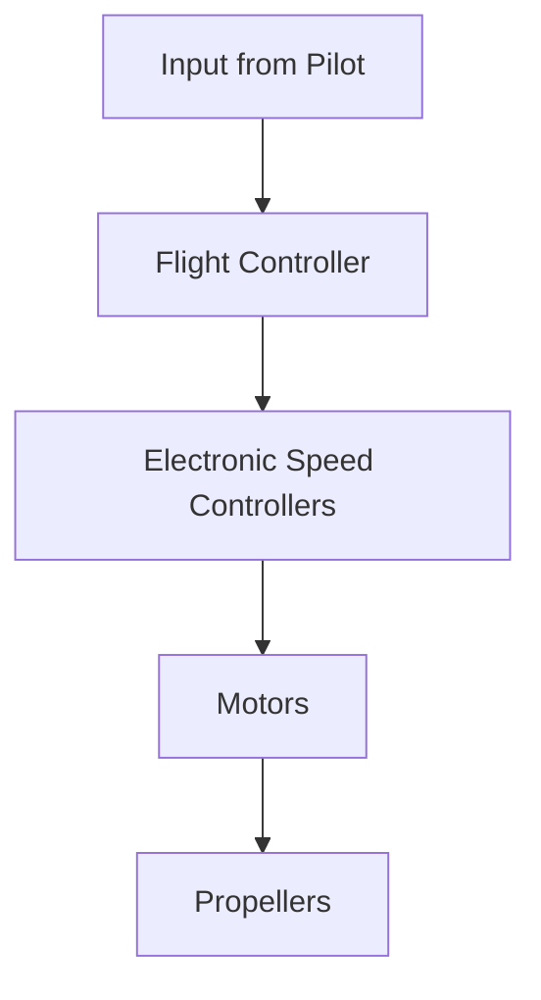

# Understanding Drones: Mechanism and Connectivity

## Basic Working Mechanism

### Components and Functionality

- **Flight Controller**: The brain of the drone, processing data from sensors to control the motors.
- **Electronic Speed Controllers (ESCs)**: Regulate the power to the motors, translating the flight controller's commands into motor movement.
- **Motors and Propellers**: Provide the thrust and lift needed for flight. Propellers create lift by spinning and pushing air downwards.
- **Sensors**: Include accelerometers, gyroscopes, barometers, and GPS modules to help the drone maintain stability and navigate.

> 

### How They Work Together

1. **Input**: The flight controller receives input from the pilot or pre-programmed instructions.
2. **Processing**: It processes data from the sensors to determine the drone's orientation and position.
3. **Control**: Commands are sent to the ESCs, which adjust the speed of the motors to control movement and maintain stability.

## Motor Types

### Brushed vs. Brushless Motors

- **Brushed Motors**: Use brushes to make contact with the commutator, causing friction and wear over time. They are cheaper but less efficient and durable.
- **Brushless Motors**: Use electronic controllers to switch the current in the motor windings. They are more efficient, durable, and provide better performance, making them ideal for modern drones.

# Drone Communication Technologies

Drones communicate with their controllers and other devices using a variety of wireless communication technologies, each suited to different ranges, data requirements, and applications.
## RF (Radio Frequency) Communication
- **RF Communication** involves the use of radio waves to transmit data between the drone and its controller.
- **Frequency Bands**: Typically uses the 2.4 GHz and 5.8 GHz bands, but long-range systems can use lower frequencies like 900 MHz.

### Mechanism
- **Modulation**: Data is encoded into radio waves using modulation techniques like Frequency Modulation (FM), Amplitude Modulation (AM), or digital modulation schemes such as Frequency-Shift Keying (FSK) and Phase-Shift Keying (PSK).
- **Transmission and Reception**: The transmitter on the controller sends radio signals to the drone’s receiver, which decodes the signals into control commands or data.
- **Range and Interference**: RF communication can be affected by obstacles, interference from other devices using the same frequency band, and regulatory power limits.

### Applications
- **Consumer Drones**: Used for standard remote control and telemetry.
- **Professional Drones**: Employed for more robust and long-range communication using proprietary protocols for enhanced reliability.

## Wi-Fi Communication
- **Wi-Fi** (Wireless Fidelity) is a wireless networking technology based on the IEEE 802.11 standards.

### Mechanism
- **Frequency Bands**: Operates mainly in the 2.4 GHz and 5 GHz bands.
- **Access Point Mode**: The drone acts as a Wi-Fi access point, and the controller (smartphone/tablet) connects to it.
- **Direct Communication**: Uses Wi-Fi Direct or similar technologies to establish a direct connection between the drone and the controller without requiring an existing Wi-Fi network.

### Advantages
- **High Data Rate**: Suitable for transmitting high-definition video and large amounts of telemetry data.
- **Ease of Use**: Common in consumer drones due to the widespread availability of Wi-Fi devices.

### Limitations
- **Range**: Limited to a few hundred meters, less than RF communication.
- **Interference**: Prone to interference from other Wi-Fi networks and devices.

### Applications
- **Consumer Drones**: Streaming live video to smartphones/tablets, controlling via mobile apps.
- **Indoor Drones**: Suitable for indoor applications where Wi-Fi infrastructure is readily available.

## Bluetooth Communication
- **Bluetooth** is a short-range wireless technology standard for exchanging data over short distances.

### Mechanism
- **Frequency Band**: Operates in the 2.4 GHz ISM band.
- **Pairing**: Devices need to be paired before communication, creating a secure connection.
- **Bluetooth Low Energy (BLE)**: Used for low-power applications, offering lower data rates compared to classic Bluetooth.

### Advantages
- **Low Power Consumption**: Ideal for small, battery-powered drones.
- **Ease of Integration**: Simple to integrate with smartphones and other Bluetooth-enabled devices.

### Limitations
- **Range**: Very limited, typically up to 100 meters.
- **Data Rate**: Lower compared to Wi-Fi and RF, not suitable for high-bandwidth applications like HD video streaming.

### Applications
- **Toy Drones**: Basic control for toys and small drones.
- **Wearable Controllers**: Used in applications where the controller might be a wearable device.

## Advanced Long-Range Systems
- **Long-Range Systems** use specialized radio equipment and protocols to extend the communication range significantly beyond what standard RF and Wi-Fi can offer.

### Mechanism
- **Frequency Bands**: Often use lower frequencies (e.g., 900 MHz) to achieve greater range and penetration through obstacles.
- **High-Power Transmitters**: Employ high-power transmitters and sensitive receivers to extend range.
- **Proprietary Protocols**: Custom protocols designed for reliability and robustness in long-range applications.

### Advantages
- **Extended Range**: Can achieve ranges of several kilometers to tens of kilometers.
- **Robustness**: Designed to maintain stable communication in challenging environments.

### Applications
- **Industrial and Agricultural Drones**: Used in large-scale operations requiring long-range communication.
- **Military and Surveillance**: Suitable for applications needing secure and reliable long-distance control and data transmission.

# Drone Navigation and Obstacle Avoidance Technologies

## GPS for Autonomous Flight and Waypoint Navigation
- **GPS (Global Positioning System)**: A satellite-based navigation system that provides location and time information.
- **Waypoint Navigation**: A method of navigating by setting a series of coordinates (waypoints) that the drone follows.

### Mechanism

1. **GPS Module**:
   - The drone's GPS module receives signals from multiple satellites to determine its precise location (latitude, longitude, and altitude).
   - The accuracy is typically within a few meters, but can be improved with DGPS (Differential GPS) or RTK (Real-Time Kinematic) systems for precision up to centimeters.

2. **Autonomous Flight**:
   - **Flight Planning**: Users define a flight path by setting waypoints on a map via ground control software.
   - **Navigation**: The drone uses its GPS module to move from one waypoint to the next, adjusting its course as needed based on GPS coordinates.
   - **Altitude Control**: GPS provides altitude data, which, combined with barometric sensors, helps maintain or adjust the drone’s altitude as required.

### Applications
- **Surveying and Mapping**: Drones can follow pre-defined paths to capture aerial images systematically.
- **Delivery Services**: Set routes for delivering packages to specific locations.
- **Agriculture**: Monitor and manage large fields by flying over them in systematic patterns.

## Sensors for Obstacle Avoidance

### Types of Sensors
- **Ultrasonic Sensors**: Use sound waves to detect objects.
- **Infrared Sensors**: Use infrared light to sense obstacles.
- **LIDAR (Light Detection and Ranging)**: Uses laser pulses to create detailed 3D maps of the surroundings.
- **Cameras**: Visual sensors used in conjunction with computer vision algorithms.
- **Radar**: Uses radio waves to detect objects, providing information on distance and speed.

### Mechanism

1. **Data Collection**:
   - Sensors continuously scan the environment to detect obstacles.
   - Each type of sensor provides different data, such as distance, size, and speed of objects.

2. **Data Processing**:
   - Onboard processors or flight controllers analyze the sensor data in real-time.
   - Advanced algorithms, including SLAM (Simultaneous Localization and Mapping), help in mapping the environment and localizing the drone within it.

3. **Decision Making**:
   - **Obstacle Detection**: Identifying potential collisions based on the processed data.
   - **Path Planning**: Adjusting the flight path to avoid obstacles while maintaining the course towards the destination.
   - **Control Adjustments**: Modifying the drone's speed and direction to navigate safely.

### Applications
- **Urban Environments**: Avoiding buildings, trees, and other structures.
- **Indoor Navigation**: Maneuvering through tight spaces and avoiding obstacles like walls and furniture.
- **Complex Terrains**: Flying through areas with uneven ground, rocks, and other natural obstacles.

## Integration for Enhanced Autonomous Capabilities

### Sensor Fusion
- Combining data from multiple sensors to improve accuracy and reliability.
- Example: Using GPS for general navigation while LIDAR and cameras handle precise obstacle avoidance.

### Advanced Algorithms
- **Machine Learning**: Enhances object recognition and decision-making processes.
- **Computer Vision**: Algorithms process camera data to detect and classify obstacles, aiding in navigation.

### Example Workflow
1. **Pre-flight Planning**: Define waypoints and flight parameters.
2. **Takeoff**: The drone uses GPS for initial positioning.
3. **Navigation**:
   - Follows waypoints using GPS.
   - Continuously scans for obstacles using onboard sensors.
   - Adjusts path in real-time to avoid collisions.
4. **Landing**: Uses GPS and sensors for precise landing at the designated location.

## Practical Considerations

### Regulations and Safety

- **Registration and Licensing**: Required for drones above certain weights in many countries.
- **Restricted Areas and Altitude Limits**: No-fly zones near airports, military bases, etc., and altitude restrictions to avoid conflicts with manned aircraft.
- **Line of Sight (LOS)**: Generally required to keep the drone within visual range unless special permissions are granted.

### Maintenance and Troubleshooting

- **Routine Maintenance**: Includes battery care, propeller inspection, motor maintenance, firmware updates, and checking structural integrity.
- **Common Issues**: GPS signal loss, compass errors, connection problems, motor failure, and camera/gimbal issues.

### Drone Piloting Skills

- **Basic Skills**: Takeoff, landing, hovering, and orientation control.
- **Advanced Maneuvers**: Waypoint navigation, manual control, and FPV flying.
- **Emergency Handling**: Procedures for signal loss, low battery, and handling environmental challenges.

## Drones Supporting Custom Control

### Research Findings

| Drone Model            | Features                                                                 | Customization                                           | Best Use Cases                                          |
|------------------------|--------------------------------------------------------------------------|---------------------------------------------------------|---------------------------------------------------------|
| **DJI Matrice 300 RTK** | Flight time up to 55 minutes, IP45 weather resistance, advanced AI capabilities, high payload capacity, multiple safety features | Extensive SDK support for custom applications, customizable flight control and payload management | Industrial inspections, public safety, surveying, and mapping |
| **Pixhawk-based Drones** | Open-source flight control (ArduPilot, PX4), suitable for research and industrial applications, flexible hardware integration | Extensive hardware and software customization, open-source platforms allow modification and enhancement | Research, industrial applications, specialized tasks     |
| **Fly4Future Drones**  | Modular hardware design, supports ROS in Linux, customizable sensor integration, various models for different applications | Modular design for hardware customization, open software platforms for custom control and data processing | Indoor inspections, outdoor research, heavy-load transport |
| **Ryze Tello**         | Affordable and easy to use, supports Tello SDK, suitable for educational purposes | Programmable with Python and MATLAB, custom control via Tello SDK | Education, hobbyist experimentation, basic custom projects |

## Conclusion

The **DJI Matrice 300 RTK** is recommended as the best overall choice due to its advanced features, robust performance, and extensive customization capabilities via SDK. It is ideal for industrial, research, and advanced applications.

## Sources

- **DJI Matrice 300 RTK**: [DJI Official Website](https://www.dji.com/matrice-300)
- **Pixhawk-based Drones**: [ArduPilot](https://ardupilot.org/), [PX4](https://px4.io/)
- **Fly4Future Drones**: [Fly4Future](https://www.fly4future.com/)
- **Ryze Tello**: [MathWorks](https://github.com/mathworks/Navigating-Ryze-Tello-Drones-With-MATLAB-App)
