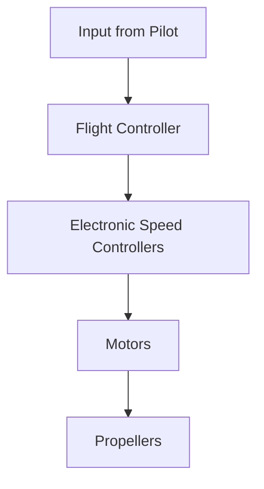

# Understanding Drones: Mechanism and Connectivity

---

## Table of Contents

1. [Basic Working Mechanism](#basic-working-mechanism)
2. [Motor Types](#motor-types)
3. [Communication Systems](#communication-systems)
4. [Navigation and GPS](#navigation-and-gps)
5. [Practical Considerations](#practical-considerations)
6. [Drones Supporting Custom Control](#drones-supporting-custom-control)
7. [Conclusion](#conclusion)
8. [Sources](#sources)

---

## Basic Working Mechanism

### Components and Functionality

- **Flight Controller**: The brain of the drone, processing data from sensors to control the motors.
- **Electronic Speed Controllers (ESCs)**: Regulate the power to the motors, translating the flight controller's commands into motor movement.
- **Motors and Propellers**: Provide the thrust and lift needed for flight. Propellers create lift by spinning and pushing air downwards.
- **Sensors**: Include accelerometers, gyroscopes, barometers, and GPS modules to help the drone maintain stability and navigate.

> 

### How They Work Together

1. **Input**: The flight controller receives input from the pilot or pre-programmed instructions.
2. **Processing**: It processes data from the sensors to determine the drone's orientation and position.
3. **Control**: Commands are sent to the ESCs, which adjust the speed of the motors to control movement and maintain stability.

## Motor Types

### Brushed vs. Brushless Motors

- **Brushed Motors**: Use brushes to make contact with the commutator, causing friction and wear over time. They are cheaper but less efficient and durable.
- **Brushless Motors**: Use electronic controllers to switch the current in the motor windings. They are more efficient, durable, and provide better performance, making them ideal for modern drones.

## Communication Systems

### RF Communication

- **Radio Frequency (RF)**: The primary method for drone-to-controller communication. It includes various protocols such as Wi-Fi, Bluetooth, and proprietary long-range systems.
- **Wi-Fi and Bluetooth**: Common in consumer drones for short-range control and data transmission.
- **Advanced Systems**: Long-range and high-frequency communication systems are used in professional drones for extended range and reliability.

## Navigation and GPS

### How Drones Navigate

- **GPS**: Provides accurate positioning and enables features like waypoint navigation and return-to-home.
- **Sensors**: Accelerometers, gyroscopes, and barometers help maintain stability and orientation.
- **Autonomous Flight**: Advanced drones use AI and machine learning for obstacle avoidance and automated flight paths.

## Practical Considerations

### Regulations and Safety

- **Registration and Licensing**: Required for drones above certain weights in many countries.
- **Restricted Areas and Altitude Limits**: No-fly zones near airports, military bases, etc., and altitude restrictions to avoid conflicts with manned aircraft.
- **Line of Sight (LOS)**: Generally required to keep the drone within visual range unless special permissions are granted.

### Maintenance and Troubleshooting

- **Routine Maintenance**: Includes battery care, propeller inspection, motor maintenance, firmware updates, and checking structural integrity.
- **Common Issues**: GPS signal loss, compass errors, connection problems, motor failure, and camera/gimbal issues.

### Drone Piloting Skills

- **Basic Skills**: Takeoff, landing, hovering, and orientation control.
- **Advanced Maneuvers**: Waypoint navigation, manual control, and FPV flying.
- **Emergency Handling**: Procedures for signal loss, low battery, and handling environmental challenges.

## Drones Supporting Custom Control

### Research Findings

| Drone Model            | Features                                                                 | Customization                                           | Best Use Cases                                          |
|------------------------|--------------------------------------------------------------------------|---------------------------------------------------------|---------------------------------------------------------|
| **DJI Matrice 300 RTK** | Flight time up to 55 minutes, IP45 weather resistance, advanced AI capabilities, high payload capacity, multiple safety features | Extensive SDK support for custom applications, customizable flight control and payload management | Industrial inspections, public safety, surveying, and mapping |
| **Pixhawk-based Drones** | Open-source flight control (ArduPilot, PX4), suitable for research and industrial applications, flexible hardware integration | Extensive hardware and software customization, open-source platforms allow modification and enhancement | Research, industrial applications, specialized tasks     |
| **Fly4Future Drones**  | Modular hardware design, supports ROS in Linux, customizable sensor integration, various models for different applications | Modular design for hardware customization, open software platforms for custom control and data processing | Indoor inspections, outdoor research, heavy-load transport |
| **Ryze Tello**         | Affordable and easy to use, supports Tello SDK, suitable for educational purposes | Programmable with Python and MATLAB, custom control via Tello SDK | Education, hobbyist experimentation, basic custom projects |

## Conclusion

The **DJI Matrice 300 RTK** is recommended as the best overall choice due to its advanced features, robust performance, and extensive customization capabilities via SDK. It is ideal for industrial, research, and advanced applications.

## Sources

- **DJI Matrice 300 RTK**: [DJI Official Website](https://www.dji.com/matrice-300)
- **Pixhawk-based Drones**: [ArduPilot](https://ardupilot.org/), [PX4](https://px4.io/)
- **Fly4Future Drones**: [Fly4Future](https://www.fly4future.com/)
- **Ryze Tello**: [MathWorks](https://github.com/mathworks/Navigating-Ryze-Tello-Drones-With-MATLAB-App)
